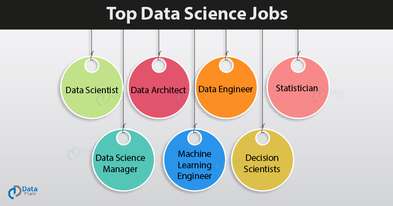
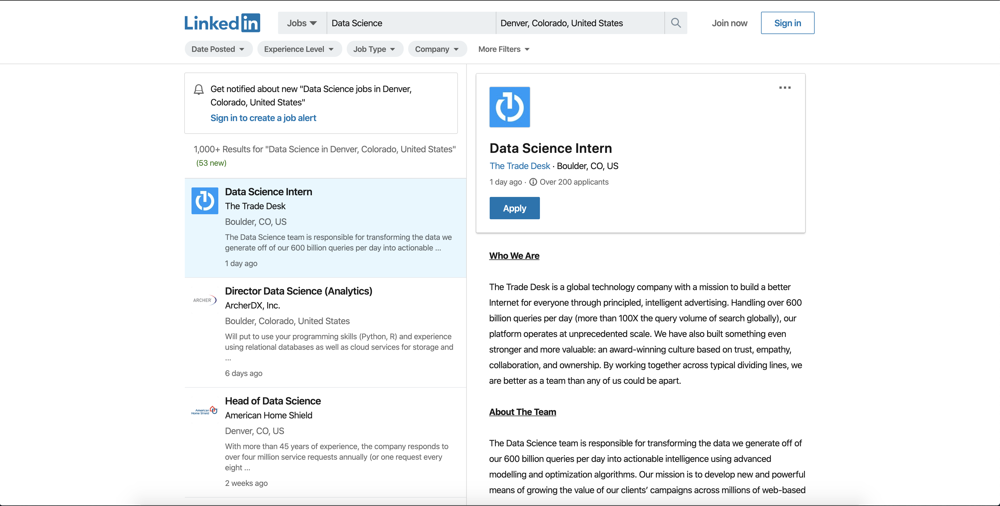
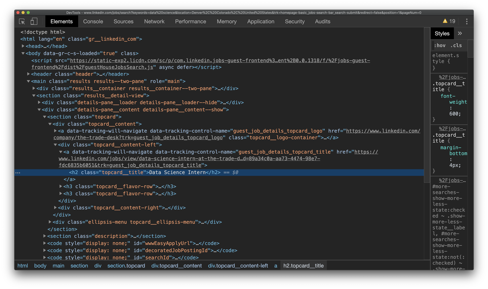
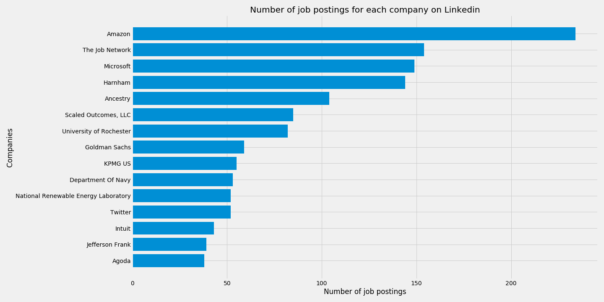
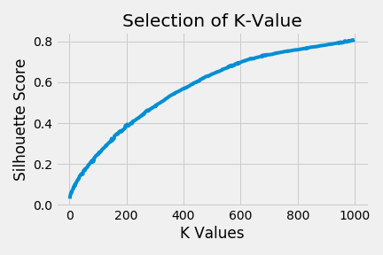
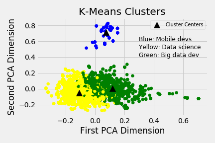
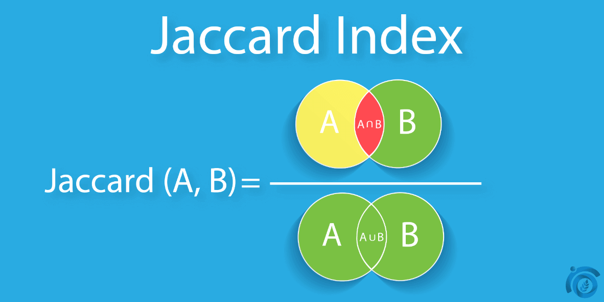
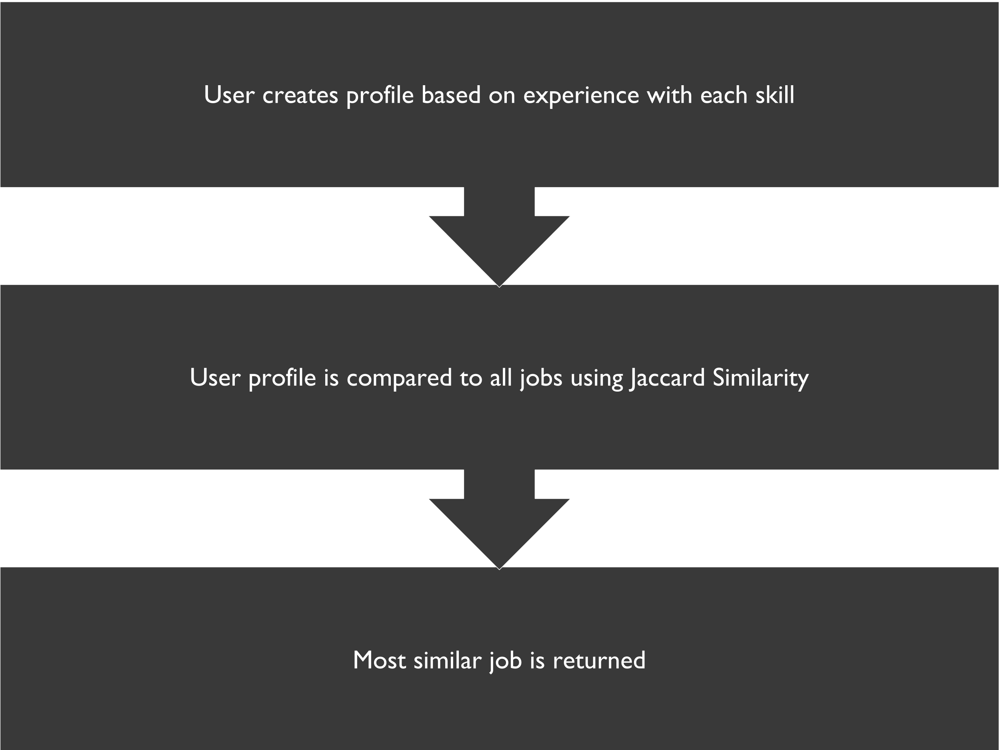
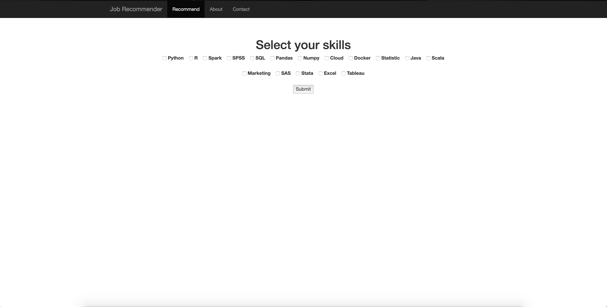

# Introduction:

* Goal of project is to match people up with jobs

* Jobs were scraped from Linkedin using Selenium and Beautiful Soup

# The Data:
Using selenium and beautiful soup, two popular python packages for web scraping and web automation, a datasets was scraped from Linkedin.com (n = 3150). The search looked at jobs that resulted from looking up 'Data Science'. This search term yielded the largest number of jobs from the search terms tested.

### Features From The Dataset:
| Linkedin job features  |
| ---------------------- |
| Company name           |
| Job title              |
| Location               |
| Number of applicants   |
| Full job description   |
|                        |

Six states were selected as states that are hubs for data science jobs.

 | States        |
 | ------------- |
 | Colorado      |
 | California    |
 | Florida       |
 | New York      |
 | Utah          |
 | Washington    |

### Example of Linkedin data:

<table border="1" class="dataframe">
  <thead>
    <tr style="text-align: right;">
      <th></th>
      <th>Job_Title</th>
      <th>Company</th>
      <th>Location</th>
      <th>Number_of_Applicants</th>
      <th>Description</th>
    </tr>
  </thead>
  <tbody>
    <tr>
      <td>0</td>
      <td>Data Acquisition Developer</td>
      <td>ABB</td>
      <td>Broomfield, CO, US</td>
      <td>Be among the first 25 applicants</td>
      <td>Join ABB and work in a team that is dedicated ...</td>
    </tr>
    <tr>
      <td>1</td>
      <td>DATA SCIENTIST MANAGER</td>
      <td>Pilgrim's</td>
      <td>Greeley, CO, US</td>
      <td>Be among the first 25 applicants</td>
      <td>Pilgrim’s is the second largest chicken produc...</td>
    </tr>
    <tr>
      <td>2</td>
      <td>Data Scientist – Logistics Optimization Algori...</td>
      <td>ShaleApps</td>
      <td>Denver, CO, US</td>
      <td>Be among the first 25 applicants</td>
      <td>Location: Denver, CO – Relocation Offered. Rem...</td>
    </tr>
  </tbody>
</table>

### Linkedin web scraping process:
To scrape Linkedin, selenium needed to be used. Beautiful soup is not enough for linkedin because one needs to click on the jobs in order to get the job information. Beautiful soup could have been used to scrape basic information such as job title and company name but because the site doesn't redirect users to the company's website, the full job description was available. In order to get this more detailed information, one needs to be able to interact with the site like a human user. Selenium's strong point is just this; that it allows one to write code that will interact with the website like a human user. Two main features of selenium that allow this are the ability to click on buttons and the ability to type in text to text fields.

In order to scrape Linkedin, the script first would navigate to the search result page and clicked on the 'see more jobs' button a given number of times allowing one to have access to more than just one page. The script then clicked on each job and passed the HTML to a beautiful soup object that then was used to parse for the information of interest.

### Example of Linkedin job:

### Example of html:

# EDA and Clustering

Companies with the largest number of postings for data science jobs on Linkedin.com

* Using a TFIDF matrix, job descriptions were vectorized and fed into a K-Means algorithm to attempt to group jobs together based on descriptions alone

* Wanted to group jobs together and recommend using clusters, but selecting the K value using the Silhouette Score elbow plot method was difficult
  * For any interpretable number of K values, the SS score was extremely low

* Using three clusters, we can see a very diverse group of jobs
  * Although the each observation - and cluster center for that matter - is located within 10,000 dimensional space, the clusters were visualized by transforming the data into two dimensional space using PCA

* Once again, all of these jobs were found by searching for the keyword 'Data Science'
 * Interesting that mobile developer jobs were included
 * In two dimensional euclidean space, we can see that the descriptions of the mobile dev jobs were quite different than the data science and big data job descriptions

# Vectorizing jobs

* Jobs were assessed on several skills

python, r, spark, spss, sql, pandas, numpy, cloud, docker, statistic, java, scala, marketing, sas, stata, excel, tableau

* Vector for each job was created to represent whether or not the job included each of the skills
    * Ex: [1, 1, 1, 1, 0, 1, 1, 0 ,0, 0, 0, 0, 0, 0, 0, 0, 1]

* User vectors were created by asking users which of the skills they had experience with

* User vector was compared to all job vectors using Jaccard Similarity
    * Most similar job was returned

### Example recommendations:
* Docker, Cloud skills only --> Senior Manager of Technology
* Python, R only --> Director - Data Science, Modeling
* Python, Marketing only --> Marketing Data Scientist

# Flask App

* Recommender was deployed on a Flask website
* Hosted on Amazon AWS EC2 instance

URL: http://34.215.60.18

# Future Directions
* Include jobs outside of data science
* Explore other text embedding methods
  * Retain semantic representations of descriptions (e.g. word-to-vec or BERT)
* Allow user to request location from recommender
* Develop strategy to isolate 'important' parts of descriptions
  * Most descriptions include fluffy details about company
* Develop more exhaustive list of skills

